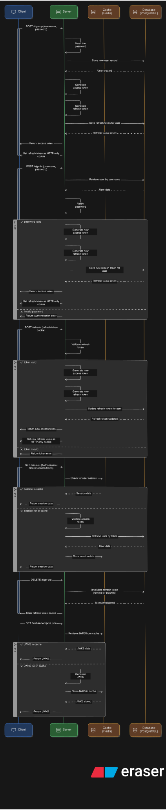

# 🔐 Token-Based Authentication API

<p align="center">
  <strong>A secure, scalable, and high-performance token-based authentication system built with Fastify, TypeScript, and PostgreSQL.</strong>
</p>

<p align="center">
  
  
  
  
</p>

---

## 🌟 Overview

This project provides a robust and efficient solution for implementing token-based authentication in modern web applications. It leverages a powerful stack of technologies to deliver a secure, fast, and developer-friendly experience. The system is designed to be stateless, making it highly scalable and suitable for microservices architectures.

---

## ✨ Features

- **Stateless Authentication:** Implements a robust, token-based authentication system using JSON Web Tokens (JWTs), ensuring stateless and scalable sessions.
- **Secure Token Management:** Utilizes RSA key pairs (RS256) for signing and verifying JWTs, providing a high level of security and ensuring that tokens cannot be tampered with.
- **Refresh Token Rotation (RTR):** Implements a refresh token rotation strategy for enhanced security, automatically invalidating old refresh tokens upon use.
- **User Management:** Provides essential endpoints for user registration and login.
- **High-Performance Backend:** Built on the [Fastify](https://www.fastify.io/) framework, a high-performance, low-overhead web framework for Node.js.
- **Type Safety:** Written entirely in [TypeScript](https://www.typescriptlang.org/) for robust type safety and an improved developer experience.
- **Modern ORM:** Uses [Drizzle ORM](https://orm.drizzle.team/) for intuitive, type-safe database queries and schema management with PostgreSQL.
- **In-Memory Caching:** Integrates with [Redis](https://redis.io/) for caching, significantly improving performance by reducing database load.
- **Interactive API Documentation:** Includes [Swagger](https://swagger.io/) for generating interactive API documentation, making it easy to explore and test endpoints.
- **Enhanced Security:** Protected against common web vulnerabilities with:
  - `@fastify/helmet`: Adds important security headers.
  - `@fastify/rate-limit`: Protects against brute-force attacks.
  - `@fastify/cors`: Manages Cross-Origin Resource Sharing (CORS).

---

## 🛠️ Technology Stack

- **Backend:** [Fastify](https://www.fastify.io/), [Node.js](https://nodejs.org/)
- **Language:** [TypeScript](https://www.typescriptlang.org/)
- **Database:** [PostgreSQL](https://www.postgresql.org/)
- **ORM:** [Drizzle ORM](https://orm.drizzle.team/)
- **Caching:** [Redis](https://redis.io/)
- **API Documentation:** [Swagger](https://swagger.io/)
- **Package Manager:** [Yarn](https://yarnpkg.com/)

---

## 🚀 Getting Started

### Prerequisites

- [Node.js](https://nodejs.org/) (v20.x or higher)
- [Yarn](https://yarnpkg.com/)
- [PostgreSQL](https://www.postgresql.org/)
- [Redis](https://redis.io/)
- [OpenSSL](https://www.openssl.org/)

### Installation & Setup

1.  **Clone the repository:**

    ```bash
    git clone https://github.com/jmrl23/token-based-authentication.git
    cd token-based-authentication
    ```

2.  **Install dependencies:**

    ```bash
    yarn install
    ```

3.  **Create the PostgreSQL database:**

    ```bash
    psql -U <your_postgres_user> -c "CREATE DATABASE <your_database_name>;"
    ```

4.  **Generate RSA key pair:**
    This command generates a 4096-bit private key.

    ```bash
    openssl genrsa -out private.key 4096
    ```

    This command extracts the public key from the private key.

    ```bash
    openssl rsa -in private.key -pubout -outform PEM -out public.key
    ```

5.  **Move the keys:**
    Place the generated `private.key` (private key) and `public.key` (public key) files inside the `./auth/<any_name>` directory.

6.  **Set up environment variables:**
    Copy the example environment file and fill in the required values.

    ```bash
    cp .env.example .env
    ```

    Reference the [.env.example](https://github.com/jmrl23/token-based-authentication/blob/main/.env.example) file for the required variables.

7.  **Run database migrations:**

    ```bash
    yarn exec drizzle-kit generate
    yarn exec drizzle-kit migrate
    ```

8.  **Build and start the application:**
    ```bash
    yarn run build
    yarn run start
    ```
    The server will be running on the port specified in your `.env` file (default is `3001`).

---

## 🎨 Diagram

Here's a high-level diagram illustrating the authentication flow:



## 📚 API Documentation

Swagger documentation is automatically generated in development mode. Once the server is running, you can access the interactive API documentation at:

[http://127.0.0.1:3001/docs](http://127.0.0.1:3001/docs#/)

---

## 📝 Notes

- In some cases, you might want to remove the `/auth/access` route for a full [Refresh Token Rotation (RTR)](https://www.descope.com/blog/post/refresh-token-rotation) approach.
- Swagger is only enabled when the server is running in development mode.

---

## 📄 License

This project is licensed under the MIT License. See the [LICENSE](./LICENSE) file for details.

---

### Acknowledgements

- This project is based on the [**fastify-template**](https://github.com/jmrl23/fastify-template). Visit the repository to learn more about the project architecture.
